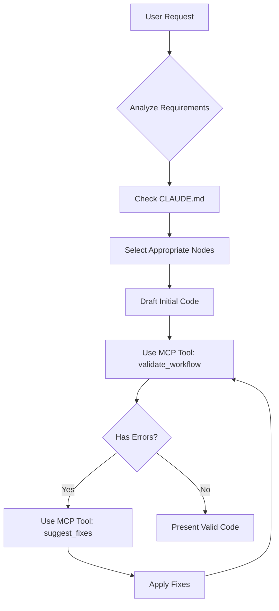

# Development Flow with Claude Code

## 🔄 Complete Development Cycle

This document describes how the MCP Parameter Validation Tool integrates with Claude Code to create a seamless development experience.

### 1. Tool Registration with Claude Code

**Configuration in Claude Desktop:**
```json
{
  "mcpServers": {
    "parameter-validator": {
      "command": "python",
      "args": ["-m", "apps.kailash-mcp.tools.parameter-validator.src.server"],
      "env": {
        "PYTHONPATH": "/path/to/kailash-python-sdk"
      }
    }
  }
}
```

**Available Tools After Registration:**
- `validate_workflow` - Check complete workflows
- `check_node_parameters` - Validate node implementations
- `validate_connections` - Check connection syntax
- `suggest_fixes` - Get fix recommendations
- `validate_gold_standards` - Check best practices
- `get_validation_patterns` - Get usage examples
- `check_error_pattern` - Find specific issues

### 2. Claude Code References SDK Patterns

**Primary Reference Files Claude Code Uses:**

1. **CLAUDE.md** (Root instructions)
   - `/Users/esperie/repos/projects/kailash_python_sdk/CLAUDE.md`
   - Core patterns, node usage, gold standards
   - Parameter passing directives
   - Common mistakes to avoid

2. **Node Selection Guide**
   - `sdk-users/2-core-concepts/nodes/node-selection-guide.md`
   - 110+ available nodes with usage patterns
   - Decision trees for node selection

3. **Parameter Passing Guide**
   - `sdk-users/3-development/parameter-passing-guide.md`
   - Three methods: node config, connections, runtime
   - Critical for avoiding PAR001-PAR004 errors

4. **Cheatsheets Directory**
   - `sdk-users/2-core-concepts/cheatsheet/`
   - Copy-paste patterns for common tasks
   - MCP integration patterns
   - AsyncSQL patterns

5. **App Framework Guides**
   - `sdk-users/4-apps/dataflow/` - DataFlow patterns
   - `sdk-users/4-apps/nexus/` - Nexus patterns
   - `sdk-users/4-apps/mcp/` - MCP patterns

### 3. Claude Code's Thought Process

**When Asked to Create Something:**



**Example Internal Process:**
```python
# 1. Claude Code thinks: "User wants data processing workflow"
# 2. Checks CLAUDE.md for patterns
# 3. Drafts initial code

workflow_draft = '''
workflow = WorkflowBuilder()
workflow.add_node("CSVReaderNode", "reader", {})  # Missing params
workflow.add_node("DataProcessorNode", "processor", {})
workflow.add_connection("reader", "processor")  # Wrong syntax
'''

# 4. ALWAYS validates before presenting
validation = mcp_tool.validate_workflow(workflow_draft)
# Result: {"has_errors": true, "errors": [...]}

# 5. Gets suggestions
fixes = mcp_tool.suggest_fixes(validation["errors"])

# 6. Applies fixes
workflow_final = '''
workflow = WorkflowBuilder()
workflow.add_node("CSVReaderNode", "reader", {"file_path": "data.csv"})
workflow.add_node("DataProcessorNode", "processor", {"operation": "clean"})
workflow.add_connection("reader", "data", "processor", "input")
'''

# 7. Re-validates
final_check = mcp_tool.validate_workflow(workflow_final)
# Result: {"has_errors": false}

# 8. Presents validated code to user
```

### 4. Writing Tests with Validation

**Claude Code's Test Writing Process:**

```python
# When writing tests, Claude Code:

# 1. Creates test workflow
test_code = '''
def test_data_pipeline():
    workflow = WorkflowBuilder()
    workflow.add_node("HTTPRequestNode", "api", {
        "url": "https://api.example.com/data"
    })
'''

# 2. Validates test code
validation = mcp_tool.validate_workflow(test_code)

# 3. Ensures test patterns are correct
if validation["has_errors"]:
    # Fix before presenting
    fixes = mcp_tool.suggest_fixes(validation["errors"])
    # Apply fixes...

# 4. Also validates assertions and execution patterns
gold_check = mcp_tool.validate_gold_standards(test_code)
```

### 5. Error Recovery Flow

**When Claude Code Encounters Errors:**

```python
# User reports: "I'm getting parameter errors"

# Claude Code's response process:
# 1. Request the error message and code
user_code = "..." # User's problematic code

# 2. Validate to understand issues
validation = mcp_tool.validate_workflow(user_code)

# 3. Analyze specific errors
for error in validation["errors"]:
    if error["code"] == "PAR004":
        # Missing required parameter
        # Check node-selection-guide.md for requirements
        # Suggest specific parameter values
    elif error["code"] == "CON002":
        # Old connection syntax
        # Reference CLAUDE.md connection patterns
        # Provide exact fix

# 4. Generate comprehensive fix
fixes = mcp_tool.suggest_fixes(validation["errors"])

# 5. Explain each issue and solution
```

## 🎯 Coverage Analysis

### ✅ Well-Covered Scenarios

1. **Parameter Validation**
   - All PAR001-PAR004 errors detected
   - Required parameters for 25+ node types
   - Type validation for NodeParameter

2. **Connection Validation**
   - 2-param vs 4-param syntax
   - Node existence checks
   - Field name validation
   - Circular dependency detection

3. **Gold Standards**
   - Execution pattern validation
   - Best practice enforcement

4. **Fix Suggestions**
   - Context-aware recommendations
   - Working code examples
   - Deduplication of suggestions

### ⚠️ Partial Coverage

1. **Dynamic Parameter Discovery**
   - Currently uses hardcoded required parameters
   - Could integrate with live NodeRegistry

2. **Complex Workflow Patterns**
   - Cyclic workflows need manual checking
   - Conditional node execution patterns

3. **Runtime Validation**
   - Focus is on static analysis
   - Runtime parameter types not validated

### 🔄 Recommended Enhancement Areas

1. **Resource Integration**
   ```python
   # Add MCP resource for pattern discovery
   @server.resource("patterns:///{pattern_type}")
   def get_pattern(pattern_type):
       # Return patterns from cheatsheet directory
       return load_pattern_from_cheatsheet(pattern_type)
   ```

2. **Auto-Import Validation**
   ```python
   # Validate imports match used nodes
   def validate_imports(code):
       # Check if all used nodes are imported
       # Suggest missing imports
   ```

3. **Workflow Complexity Metrics**
   ```python
   # Add complexity analysis
   def analyze_complexity(workflow_info):
       return {
           "node_count": len(nodes),
           "connection_density": connections/nodes,
           "max_depth": calculate_depth(),
           "suggestions": recommend_patterns()
       }
   ```

## 🚀 Optimal Usage Pattern

**For Claude Code to maximize effectiveness:**

1. **Always validate before presenting code**
2. **Use pattern resources for initial design**
3. **Apply fixes iteratively with validation**
4. **Check gold standards for best practices**
5. **Provide working examples from patterns**

**The tool ensures Claude Code:**
- Never presents code with parameter errors
- Always uses correct connection syntax
- Follows SDK best practices
- Provides immediate fixes for any issues
- Learns from patterns to improve suggestions