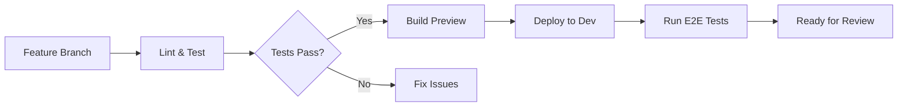
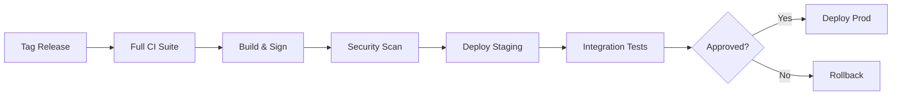

# CI/CD Pipeline Documentation

This directory contains CI/CD pipeline configurations for multiple platforms, enabling automated testing, building, and deployment of the Kailash platform.

## 🏗️ Pipeline Architecture

```
┌─────────────────────────────────────────────────────────────────┐
│                         Source Code                              │
│                     (Git Push/PR/Tag)                           │
└───────────────────────┬─────────────────────────────────────────┘
                        │
                        ▼
┌─────────────────────────────────────────────────────────────────┐
│                      CI Pipeline                                 │
├─────────────────────────────────────────────────────────────────┤
│  ┌──────────┐  ┌──────────┐  ┌──────────┐  ┌──────────┐      │
│  │   Lint   │  │   Test   │  │  Build   │  │ Security │      │
│  │  Check   │─▶│   Code   │─▶│  Image   │─▶│   Scan   │      │
│  └──────────┘  └──────────┘  └──────────┘  └──────────┘      │
└───────────────────────┬─────────────────────────────────────────┘
                        │
                        ▼
┌─────────────────────────────────────────────────────────────────┐
│                      CD Pipeline                                 │
├─────────────────────────────────────────────────────────────────┤
│  ┌──────────┐  ┌──────────┐  ┌──────────┐  ┌──────────┐      │
│  │  Deploy  │  │   Run    │  │  Verify  │  │ Rollback │      │
│  │   Dev    │─▶│   E2E    │─▶│   Prod   │─▶│ if Fail  │      │
│  └──────────┘  └──────────┘  └──────────┘  └──────────┘      │
└─────────────────────────────────────────────────────────────────┘
```

## 📁 Supported Platforms

### 1. GitHub Actions
- **Location**: `.github/workflows/`
- **Features**: Native GitHub integration, matrix builds, reusable workflows
- **Best for**: GitHub-hosted repositories

### 2. GitLab CI
- **Location**: `.gitlab-ci.yml`
- **Features**: Built-in container registry, environments, manual approvals
- **Best for**: Self-hosted GitLab or GitLab.com

### 3. ArgoCD
- **Location**: `deployment/argocd/`
- **Features**: GitOps, declarative deployments, automatic sync
- **Best for**: Kubernetes-native deployments

## 🚀 Pipeline Stages

### 1. Continuous Integration (CI)

#### Code Quality
- **Linting**: Python (black, flake8, mypy), Terraform, Kubernetes manifests
- **Security**: Bandit, Safety, Trivy, Snyk
- **License**: FOSSA compliance checking

#### Testing
- **Unit Tests**: Pytest with coverage
- **Integration Tests**: With real databases
- **E2E Tests**: Playwright/Cypress
- **Performance Tests**: K6 load testing

#### Build & Package
- **Docker Images**: Multi-arch builds
- **Helm Charts**: Package and lint
- **Documentation**: Build and validate

### 2. Continuous Deployment (CD)

#### Deployment Strategies
- **Development**: Automatic deployment on push
- **Staging**: Automatic deployment from main
- **Production**: Manual approval required

#### Verification
- **Health Checks**: Endpoint monitoring
- **Smoke Tests**: Critical path validation
- **Rollback**: Automatic on failure

## 🔧 Configuration

### Environment Variables

**GitHub Actions**:
```yaml
env:
  REGISTRY: ghcr.io
  IMAGE_NAME: ${{ github.repository }}
```

**GitLab CI**:
```yaml
variables:
  REGISTRY: $CI_REGISTRY
  IMAGE_NAME: $CI_REGISTRY_IMAGE
```

### Secrets Management

**Required Secrets**:
- `REGISTRY_USERNAME` / `REGISTRY_PASSWORD`
- `KUBERNETES_CONFIG` or cloud credentials
- `SLACK_WEBHOOK_URL` (notifications)
- `SNYK_TOKEN` (security scanning)
- `SONAR_TOKEN` (code quality)

## 📊 Pipeline Examples

### Feature Branch Workflow



### Release Workflow



## 🔒 Security Best Practices

### Secret Handling
- Never commit secrets to repository
- Use platform-native secret management
- Rotate credentials regularly
- Audit secret access

### Image Security
- Scan all images before deployment
- Use minimal base images
- Sign images with cosign
- Implement admission controllers

### Pipeline Security
- Restrict workflow permissions
- Use OIDC for cloud authentication
- Enable branch protection
- Audit pipeline changes

## 📈 Monitoring & Metrics

### Pipeline Metrics
- Build success rate
- Deployment frequency
- Lead time for changes
- Mean time to recovery (MTTR)

### Dashboards
```yaml
# Grafana dashboard for CI/CD metrics
- pipeline_duration_seconds
- deployment_success_rate
- test_coverage_percentage
- security_vulnerabilities_count
```

## 🛠️ Troubleshooting

### Common Issues

1. **Build Failures**
   ```bash
   # Check logs
   gh run view <run-id> --log
   
   # Re-run failed jobs
   gh run rerun <run-id> --failed
   ```

2. **Deployment Failures**
   ```bash
   # Check pod status
   kubectl get pods -n <namespace>
   kubectl describe pod <pod-name>
   kubectl logs <pod-name>
   ```

3. **Test Failures**
   ```bash
   # Download artifacts
   gh run download <run-id>
   
   # View test reports
   open test-results/index.html
   ```

## 🎯 Platform-Specific Guides

### GitHub Actions

**Reusable Workflows**:
```yaml
# .github/workflows/reusable-deploy.yml
on:
  workflow_call:
    inputs:
      environment:
        required: true
        type: string

jobs:
  deploy:
    uses: ./.github/workflows/deploy-template.yml
    with:
      environment: ${{ inputs.environment }}
```

**Matrix Builds**:
```yaml
strategy:
  matrix:
    python-version: [3.9, 3.10, 3.11]
    os: [ubuntu-latest, macos-latest]
```

### GitLab CI

**Dynamic Environments**:
```yaml
deploy:review:
  environment:
    name: review/$CI_COMMIT_REF_SLUG
    url: https://$CI_COMMIT_REF_SLUG.example.com
    on_stop: stop:review
    auto_stop_in: 1 week
```

**DAG Pipelines**:
```yaml
stages:
  - build
  - test
  - deploy

build:
  stage: build
  
unit-tests:
  stage: test
  needs: ["build"]
  
integration-tests:
  stage: test
  needs: ["build"]
  
deploy:
  stage: deploy
  needs: ["unit-tests", "integration-tests"]
```

### ArgoCD

**Progressive Delivery**:
```yaml
apiVersion: argoproj.io/v1alpha1
kind: Rollout
metadata:
  name: kailash-app
spec:
  replicas: 5
  strategy:
    canary:
      steps:
      - setWeight: 20
      - pause: {duration: 1m}
      - setWeight: 40
      - pause: {duration: 1m}
      - setWeight: 60
      - pause: {duration: 1m}
      - setWeight: 80
      - pause: {duration: 1m}
```

## 📝 Best Practices

1. **Keep pipelines fast** - parallelize where possible
2. **Cache dependencies** - use platform caching features
3. **Fail fast** - run quick checks first
4. **Use artifacts** - preserve test results and reports
5. **Version everything** - including pipeline configurations
6. **Monitor pipeline health** - track metrics and failures
7. **Document changes** - maintain changelog for pipelines

## 🔗 Useful Resources

### GitHub Actions
- [Actions Documentation](https://docs.github.com/actions)
- [Starter Workflows](https://github.com/actions/starter-workflows)
- [Action Marketplace](https://github.com/marketplace)

### GitLab CI
- [GitLab CI Documentation](https://docs.gitlab.com/ee/ci/)
- [CI/CD Examples](https://docs.gitlab.com/ee/ci/examples/)
- [Pipeline Templates](https://gitlab.com/gitlab-org/gitlab/-/tree/master/lib/gitlab/ci/templates)

### ArgoCD
- [ArgoCD Documentation](https://argo-cd.readthedocs.io/)
- [Application Examples](https://github.com/argoproj/argocd-example-apps)
- [Best Practices](https://argo-cd.readthedocs.io/en/stable/user-guide/best_practices/)

## 🎓 Migration Guide

### From Jenkins to GitHub Actions

```yaml
# Jenkins
pipeline {
    agent any
    stages {
        stage('Build') {
            steps {
                sh 'make build'
            }
        }
    }
}

# GitHub Actions equivalent
jobs:
  build:
    runs-on: ubuntu-latest
    steps:
      - uses: actions/checkout@v4
      - run: make build
```

### From GitLab CI to GitHub Actions

```yaml
# GitLab CI
build:
  script:
    - docker build -t $CI_REGISTRY_IMAGE:$CI_COMMIT_SHA .
    - docker push $CI_REGISTRY_IMAGE:$CI_COMMIT_SHA

# GitHub Actions equivalent
build:
  steps:
    - name: Build and push
      run: |
        docker build -t ${{ env.REGISTRY }}/${{ env.IMAGE_NAME }}:${{ github.sha }} .
        docker push ${{ env.REGISTRY }}/${{ env.IMAGE_NAME }}:${{ github.sha }}
```