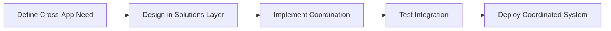
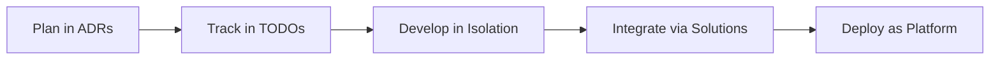

# Project Developer Guide

Complete guide for developing with this client project template, covering project-specific patterns, team coordination, and deployment strategies.

## 📋 Quick Navigation

| **What You Need** | **Where to Go** |
|-------------------|-----------------|
| **Start a new project** | [Getting Started](getting-started.md) |
| **Understand the architecture** | [Architecture Overview](architecture-overview.md) |
| **Build individual apps** | [Apps Development Guide](../../apps/APP_DEVELOPMENT_GUIDE.md) |
| **Coordinate multiple apps** | [Multi-App Coordination](multi-app-coordination.md) |
| **Deploy to production** | [Deployment Guide](deployment-guide.md) |
| **Team collaboration** | [Team Workflows](team-workflows.md) |
| **Solve common issues** | [Troubleshooting](troubleshooting.md) |
| **Use Kailash SDK** | [SDK User Guide](../../sdk-users/developer/README.md) |

## 🎯 Guide Hierarchy

This project template has three levels of documentation:

### 1. **Project Development** (This Guide)
- **Purpose**: Client project-specific guidance
- **Location**: `guides/developer/`
- **Covers**: Project setup, team coordination, deployment pipeline, cross-app architecture
- **Audience**: Project teams working on client deliveries

### 2. **App Development** 
- **Purpose**: Individual app development patterns
- **Location**: `apps/APP_DEVELOPMENT_GUIDE.md`
- **Covers**: Single app architecture, SDK integration, testing, deployment
- **Audience**: Developers building specific applications

### 3. **SDK Usage**
- **Purpose**: Kailash SDK reference and patterns
- **Location**: `sdk-users/`
- **Covers**: SDK nodes, workflows, runtime configuration, best practices
- **Audience**: Developers using Kailash SDK features

## 🚀 Getting Started

### New to This Project Template?
1. **Start Here**: [Getting Started Guide](getting-started.md)
2. **Understand the Structure**: [Architecture Overview](architecture-overview.md)
3. **Build Your First App**: [Apps Development Guide](../../apps/APP_DEVELOPMENT_GUIDE.md)
4. **Learn SDK Patterns**: [SDK User Guide](../../sdk-users/developer/README.md)

### Project Team Lead?
1. **Project Setup**: [Getting Started Guide](getting-started.md)
2. **Team Coordination**: [Team Workflows](team-workflows.md)
3. **Multi-App Strategy**: [Multi-App Coordination](multi-app-coordination.md)
4. **Deployment Pipeline**: [Deployment Guide](deployment-guide.md)

### Experienced Developer?
- **Quick Reference**: [SDK Cheatsheet](../../sdk-users/cheatsheet/README.md)
- **Production Patterns**: [SDK Workflows](../../sdk-users/workflows/by-pattern/README.md)
- **Cross-App Patterns**: [Solutions Layer](../../solutions/README.md)

## 🏗️ Project Template Architecture

This template is designed for **enterprise client projects** with multiple applications:

```
Client Project Structure:
├── apps/                    # Individual applications (isolated)
│   ├── user_management/     # Enterprise authentication & authorization
│   ├── analytics/           # Data processing & dashboards  
│   ├── document_processor/  # AI-powered document workflows
│   └── _template/           # Template for new apps
├── solutions/               # Cross-app orchestration
│   ├── tenant_orchestration/ # Multi-app workflows
│   ├── shared_services/     # Common services (auth, caching)
│   └── data_integration/    # Cross-app data flows
├── guides/developer/        # Project-specific guidance (this guide)
├── sdk-users/              # Kailash SDK reference
└── deployment/             # Infrastructure & deployment
├── guides/developer/        # Project-specific guidance (this guide)
```

### Key Design Principles

1. **Isolated Applications**: Each app in `apps/` is self-contained with its own project management
2. **Cross-App Coordination**: Use `solutions/` for workflows that span multiple apps
3. **SDK-First Development**: Leverage Kailash SDK nodes instead of custom code
4. **Enterprise Ready**: Built-in security, monitoring, and deployment patterns

## 🔄 Development Workflow

### Individual App Development


### Multi-App Coordination


### Team Collaboration


## 💡 Project-Specific Best Practices

### 1. **Conflict-Free Development**
- Each app has isolated `adr/`, `todos/`, `mistakes/` folders
- Teams work in separate app directories
- Cross-app coordination happens in `solutions/`

### 2. **SDK-First Approach**
- Use Kailash nodes instead of custom implementations
- Check `sdk-users/nodes/` before creating custom solutions
- Follow SDK patterns from `sdk-users/workflows/`

### 3. **Enterprise Patterns**
- Implement proper authentication and authorization
- Use centralized logging and monitoring
- Follow security best practices from day one

### 4. **Documentation Standards**
- Document architecture decisions in `adr/`
- Track progress in `todos/`
- Record learnings in `mistakes/`
- Keep project guide current

## 🛠️ Common Development Scenarios

### Scenario 1: Adding a New App
1. Copy `apps/_template/` to new app name
2. Follow [App Development Guide](../../apps/APP_DEVELOPMENT_GUIDE.md)
3. Integrate with existing apps via `solutions/`

### Scenario 2: Cross-App Feature
1. Design coordination in `solutions/`
2. Implement shared services
3. Update individual apps to use coordination layer

### Scenario 3: Deployment Changes
1. Update deployment configurations
2. Test in staging environment
3. Follow [Deployment Guide](deployment-guide.md)

### Scenario 4: Team Onboarding
1. Review [Getting Started](getting-started.md)
2. Set up development environment
3. Follow [Team Workflows](team-workflows.md)

## 📚 Reference Documentation

### Internal References
- **SDK Usage**: `sdk-users/developer/` - Complete Kailash SDK guide
- **App Development**: `apps/APP_DEVELOPMENT_GUIDE.md` - Individual app patterns
- **Cross-App Patterns**: `solutions/README.md` - Multi-app coordination
- **API Documentation**: `docs/api/` - API reference

### External References
- **Kailash SDK**: [PyPI Package](https://pypi.org/project/kailash/)
- **FastAPI**: [Documentation](https://fastapi.tiangolo.com/)
- **Docker**: [Documentation](https://docs.docker.com/)
- **Kubernetes**: [Documentation](https://kubernetes.io/docs/)

## 🆘 Getting Help

### Project-Specific Issues
1. Check [Troubleshooting Guide](troubleshooting.md)
2. Review `mistakes/` folders in relevant apps
3. Search existing ADRs for similar decisions

### SDK-Related Issues
1. Check [SDK Troubleshooting](../../sdk-users/developer/07-troubleshooting.md)
2. Review [Common Mistakes](../../sdk-users/validation/common-mistakes.md)
3. Check [SDK Workflows](../../sdk-users/workflows/by-pattern/)

### Team Coordination Issues
1. Review [Team Workflows](team-workflows.md)
2. Check project ADRs for established patterns
3. Consult with project leads

---

**This project developer guide provides the foundation for successful client project delivery using the Kailash SDK template. Each section links to detailed guides for specific scenarios, ensuring teams can work efficiently while maintaining enterprise-grade quality.**