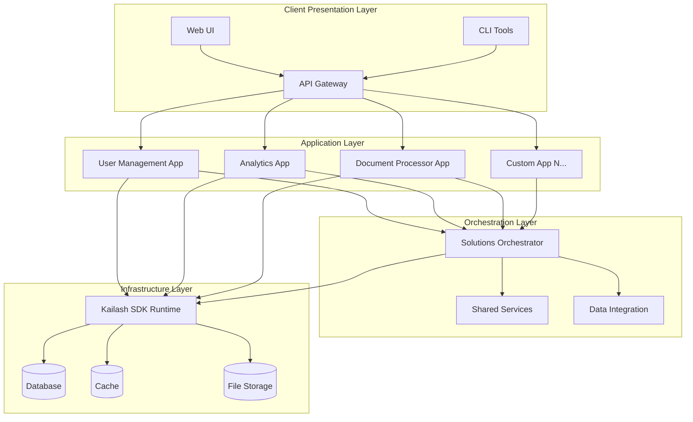
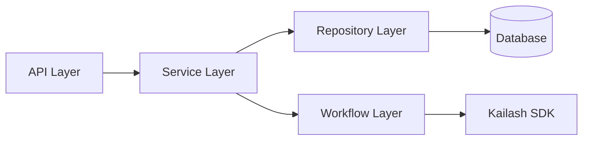
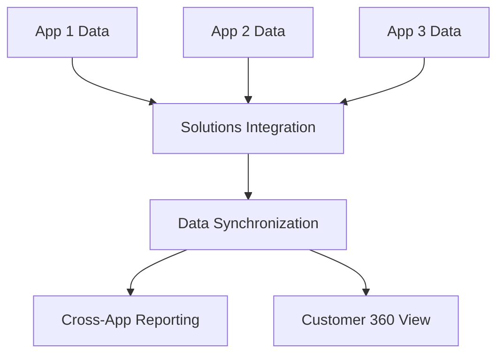

# Architecture Overview

Comprehensive overview of the client project template architecture, design decisions, and integration patterns.

## 🏗️ High-Level Architecture

### System Design Philosophy

This template implements a **Multi-Application Enterprise Platform** designed for client projects that require:

1. **Isolated Application Development** - Teams work on separate apps without conflicts
2. **Cross-Application Orchestration** - Coordinated workflows spanning multiple apps
3. **SDK-First Development** - Leverage Kailash SDK instead of custom implementations
4. **Enterprise-Grade Infrastructure** - Security, monitoring, scalability built-in



## 📁 Directory Architecture

### Layered Structure Design

```
client-project/
├── 🎯 Presentation Layer
│   ├── deployment/gateway/          # Unified API gateway
│   ├── apps/*/api/                  # Individual app APIs
│   └── apps/*/cli/                  # Command-line interfaces
│
├── 📱 Application Layer  
│   ├── apps/user_management/        # Isolated enterprise app
│   ├── apps/analytics/              # Isolated analytics app
│   ├── apps/document_processor/     # Isolated document app
│   └── apps/_template/              # New app template
│
├── 🔄 Orchestration Layer
│   ├── solutions/tenant_orchestration/  # Multi-app workflows
│   ├── solutions/shared_services/       # Common services
│   └── solutions/data_integration/      # Cross-app data flows
│
├── 🛠️ Platform Layer
│   ├── sdk-users/                   # Kailash SDK integration
│   ├── core/                        # Common platform utilities
│   └── infrastructure/              # Deployment infrastructure
│
└── 📊 Data Layer
    ├── data/inputs/                 # Input data sources
    ├── data/outputs/                # Generated outputs
    └── data/configs/                # Configuration data
```

### Isolation Boundaries

**App-Level Isolation**
- Each app has independent: `adr/`, `todos/`, `mistakes/`, `tests/`
- Self-contained business logic and data models
- Independent API endpoints and CLI commands
- Isolated development and deployment cycles

**Coordination Points**
- Cross-app workflows managed in `solutions/`
- Shared services exposed through `solutions/shared_services/`
- Data integration via `solutions/data_integration/`

## 🔧 Technology Stack

### Core Technologies

| Layer | Technology | Purpose |
|-------|------------|---------|
| **SDK Framework** | Kailash Python SDK | Workflow orchestration, AI integration |
| **Web Framework** | FastAPI | High-performance REST APIs |
| **CLI Framework** | Click | Command-line interfaces |
| **Database** | SQLAlchemy + PostgreSQL/SQLite | Data persistence |
| **Containerization** | Docker + Docker Compose | Development and deployment |
| **Orchestration** | Kubernetes (optional) | Production scaling |

### Kailash SDK Integration

**Node Categories Used**
```python
# Data Processing Nodes
from kailash.nodes.data import CSVReaderNode, SQLDatabaseNode, JSONReaderNode

# AI/ML Nodes  
from kailash.nodes.ai import LLMAgentNode, EmbeddingGeneratorNode, MonitoredLLMAgentNode

# API Integration Nodes
from kailash.nodes.api import HTTPRequestNode, RESTClientNode, GraphQLClientNode

# Logic Control Nodes
from kailash.nodes.logic import SwitchNode, MergeNode, WorkflowNode

# Security Nodes
from kailash.nodes.security import AccessControlManager, ThreatDetectionNode
```

**Runtime Configuration**
```python
from kailash.runtime import LocalRuntime

# Standard configuration for all apps
runtime = LocalRuntime(
    enable_async=True,           # Better performance
    enable_monitoring=True,      # Production observability
    enable_security=True,        # Enterprise security
    max_concurrent_nodes=10      # Concurrency control
)
```

## 📱 Application Architecture

### Individual App Structure

Each application follows a consistent layered architecture:

```
apps/my_app/
├── 🏢 Business Layer
│   ├── core/models.py           # Data models (SQLAlchemy/Pydantic)
│   ├── core/services.py         # Business logic services
│   └── core/repositories.py     # Data access patterns
│
├── 🌐 Interface Layer  
│   ├── api/main.py              # FastAPI application
│   ├── api/routes/              # API endpoint routing
│   └── cli/main.py              # Click CLI commands
│
├── 🔄 Workflow Layer
│   ├── workflows/               # Kailash SDK workflows
│   ├── nodes/                   # Custom SDK nodes
│   └── services/                # Workflow orchestration
│
├── 🧪 Testing Layer
│   ├── tests/unit/              # Fast, isolated tests
│   ├── tests/integration/       # Component interaction tests
│   ├── tests/functional/        # Feature validation tests
│   └── tests/e2e/               # End-to-end scenarios
│
└── 📋 Management Layer
    ├── adr/                     # Architecture decisions
    ├── todos/                   # Task tracking
    ├── mistakes/                # Learning documentation
    └── docs/                    # App-specific documentation
```

### App Integration Patterns

**Intra-App Communication**
```python
# Service layer coordinates between components
class CustomerService:
    def __init__(self, repository, workflow_runner):
        self.repository = repository
        self.workflow_runner = workflow_runner
    
    def create_customer_with_ai_validation(self, customer_data):
        # Business logic
        customer = self.repository.create(customer_data)
        
        # Workflow integration
        validation_results = self.workflow_runner.execute(
            "customer_validation_workflow",
            {"customer_id": customer.id}
        )
        
        # Process results
        customer.validation_score = validation_results["score"]
        return self.repository.update(customer)
```

**Cross-App Communication**
```python
# Apps communicate through solutions layer
from solutions.shared_services.customer_service import CustomerServiceClient

class AnalyticsService:
    def __init__(self):
        self.customer_client = CustomerServiceClient()
    
    def analyze_customer_behavior(self, customer_id):
        # Get customer data from user management app
        customer = self.customer_client.get_customer(customer_id)
        
        # Perform analytics-specific processing
        behavior_data = self.process_customer_data(customer)
        return behavior_data
```

## 🔄 Solutions Layer Architecture

### Cross-App Orchestration

The solutions layer enables coordination between applications without tight coupling:

```
solutions/
├── 🎯 Tenant Orchestration
│   ├── user_onboarding.py       # Spans user management + analytics
│   ├── data_pipeline.py         # Spans analytics + document processor
│   └── compliance_workflow.py   # Spans all apps for compliance
│
├── 🔧 Shared Services
│   ├── authentication.py       # SSO across all apps
│   ├── caching.py              # Shared caching layer
│   ├── messaging.py            # Inter-app messaging
│   └── monitoring.py           # Centralized monitoring
│
└── 📊 Data Integration
    ├── customer_360.py         # Unified customer view
    ├── reporting.py            # Cross-app reporting
    └── data_sync.py            # Data synchronization
```

### Orchestration Patterns

**Workflow Coordination**
```python
# solutions/tenant_orchestration/user_onboarding.py
from kailash import Workflow
from apps.user_management.workflows import CreateUserWorkflow
from apps.analytics.workflows import SetupTrackingWorkflow

class CompleteUserOnboardingWorkflow(Workflow):
    def __init__(self):
        super().__init__("complete_user_onboarding")
        
        # Coordinate multiple app workflows
        self.user_creation = CreateUserWorkflow()
        self.analytics_setup = SetupTrackingWorkflow()
        
        # Define cross-app data flow
        self.add_edge(
            self.user_creation.output_node,
            self.analytics_setup.input_node,
            data_mapping={"user_id": "tracking_user_id"}
        )
```

**Service Composition**
```python
# solutions/shared_services/customer_service.py
class UnifiedCustomerService:
    def __init__(self):
        self.user_mgmt = UserManagementServiceClient()
        self.analytics = AnalyticsServiceClient()
        self.documents = DocumentServiceClient()
    
    def get_customer_360_view(self, customer_id):
        # Compose data from multiple apps
        profile = self.user_mgmt.get_profile(customer_id)
        behavior = self.analytics.get_behavior(customer_id)
        documents = self.documents.get_customer_documents(customer_id)
        
        return Customer360View(
            profile=profile,
            behavior=behavior,
            documents=documents
        )
```

## 🚢 Deployment Architecture

### Development Environment

**Local Development Stack**
```yaml
# docker-compose.yml
services:
  # Individual app services
  user-management:
    build: ./apps/user_management
    ports: ["8001:8000"]
    
  analytics:
    build: ./apps/analytics  
    ports: ["8002:8000"]
    
  # Shared infrastructure
  postgres:
    image: postgres:15
    environment:
      POSTGRES_DB: client_project
      
  redis:
    image: redis:7-alpine
    
  # Centralized gateway
  gateway:
    build: ./deployment/gateway
    ports: ["8000:8000"]
    depends_on: [user-management, analytics]
```

### Production Architecture

**Kubernetes Deployment Pattern**
```yaml
# deployment/kubernetes/apps/user-management/deployment.yaml
apiVersion: apps/v1
kind: Deployment
metadata:
  name: user-management
spec:
  replicas: 3
  selector:
    matchLabels:
      app: user-management
  template:
    spec:
      containers:
      - name: user-management
        image: client-project/user-management:latest
        ports:
        - containerPort: 8000
        env:
        - name: DATABASE_URL
          valueFrom:
            secretKeyRef:
              name: database-secrets
              key: url
```

**Service Mesh Integration**
- **Ingress**: Route external traffic to appropriate services
- **Service Discovery**: Automatic service registration and discovery
- **Load Balancing**: Distribute traffic across app instances
- **Circuit Breaking**: Prevent cascade failures between apps

## 🔐 Security Architecture

### Multi-Layered Security

**Application Security**
```python
# Integrated into each app
from kailash.nodes.security import AccessControlManager

class SecureWorkflow(Workflow):
    def __init__(self):
        super().__init__("secure_workflow")
        
        # RBAC/ABAC access control
        self.access_control = AccessControlManager(
            strategy="hybrid",
            policy_store="database"
        )
        
        # Threat detection
        self.threat_detection = ThreatDetectionNode(
            model="enterprise",
            real_time=True
        )
```

**Cross-App Security**
```python
# solutions/shared_services/authentication.py
class EnterpriseAuthService:
    def __init__(self):
        self.sso_provider = SSOProvider()
        self.mfa_service = MFAService()
        
    def authenticate_cross_app(self, token, app_context):
        # Validate token across all apps
        user = self.sso_provider.validate_token(token)
        
        # Apply context-specific permissions
        permissions = self.get_app_permissions(user, app_context)
        
        return AuthenticatedUser(user=user, permissions=permissions)
```

## 📊 Data Architecture

### Data Flow Patterns

**Intra-App Data Flow**


**Inter-App Data Flow**


### Data Consistency Strategy

**Within Apps**: Strong consistency using database transactions
**Between Apps**: Eventual consistency using event-driven synchronization
**Reporting**: Read replicas and data warehousing for analytics

## 🔄 Event-Driven Architecture

### Event Flow
```python
# Event publishing from apps
class CustomerService:
    def create_customer(self, customer_data):
        customer = self.repository.create(customer_data)
        
        # Publish event for other apps
        self.event_publisher.publish(
            event_type="customer.created",
            data={"customer_id": customer.id, "tenant_id": customer.tenant_id}
        )
        
        return customer

# Event consumption in solutions layer
class CustomerEventHandler:
    def handle_customer_created(self, event_data):
        # Trigger cross-app workflows
        analytics_workflow = SetupCustomerAnalyticsWorkflow()
        analytics_workflow.execute(event_data)
        
        document_workflow = InitializeDocumentFoldersWorkflow()
        document_workflow.execute(event_data)
```

## 🎯 Design Decisions & Trade-offs

### Key Architectural Decisions

| Decision | Rationale | Trade-offs |
|----------|-----------|------------|
| **Multi-App Structure** | Team isolation, independent deployment | Complexity in cross-app coordination |
| **Kailash SDK First** | Leverage proven patterns, reduce custom code | Learning curve, SDK dependency |
| **FastAPI for APIs** | High performance, automatic documentation | Python ecosystem lock-in |
| **Solutions Layer** | Controlled cross-app integration | Additional abstraction layer |
| **Docker + K8s** | Consistent deployment, scalability | Infrastructure complexity |

### Performance Considerations

**Scaling Strategy**
- **Horizontal Scaling**: Each app scales independently
- **Caching Strategy**: Redis for shared data, app-level caching for local data
- **Database Strategy**: App-specific databases with shared read replicas

**Monitoring Strategy**
- **App-Level**: Individual app health checks and metrics
- **Cross-App**: Solutions layer performance monitoring  
- **Infrastructure**: Container and infrastructure metrics

---

**This architecture provides a robust foundation for enterprise client projects, balancing team autonomy with system integration needs while leveraging the power of the Kailash SDK for workflow orchestration.**