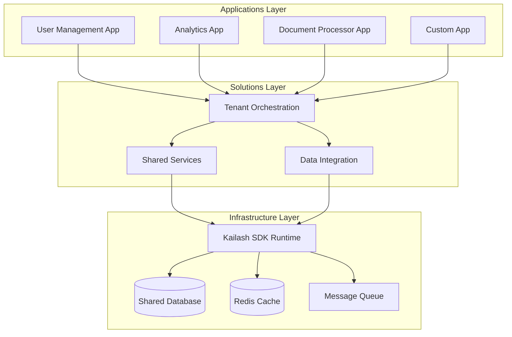

# Multi-App Coordination Guide

Complete guide for coordinating multiple applications within the client project template using the solutions layer.

## 🎯 Overview

Multi-app coordination enables complex enterprise workflows that span multiple applications while maintaining clean separation between apps. This guide covers patterns, implementation strategies, and best practices.

## 🏗️ Coordination Architecture

### Solutions Layer Structure

```
solutions/
├── 🎯 tenant_orchestration/     # Multi-app workflows
│   ├── user_onboarding.py       # User Management + Analytics + Documents
│   ├── compliance_audit.py      # All apps for compliance checking
│   └── data_pipeline.py         # Analytics + Document Processing
├── 🔧 shared_services/          # Common services across apps
│   ├── authentication.py       # SSO across all applications
│   ├── caching.py              # Shared caching layer
│   ├── messaging.py            # Inter-app messaging
│   └── monitoring.py           # Centralized monitoring
└── 📊 data_integration/         # Cross-app data flows
    ├── customer_360.py         # Unified customer view
    ├── reporting.py            # Cross-app reporting
    └── data_sync.py            # Data synchronization
```

### Coordination Patterns



## 🔄 Workflow Coordination

### Pattern 1: Sequential App Coordination

**Use Case**: User onboarding that requires multiple apps to process in sequence

```python
# solutions/tenant_orchestration/user_onboarding.py
from kailash import Workflow
from kailash.nodes.logic import SwitchNode, MergeNode
from apps.user_management.workflows import CreateUserWorkflow
from apps.analytics.workflows import SetupTrackingWorkflow
from apps.document_processor.workflows import CreateUserFoldersWorkflow

class CompleteUserOnboardingWorkflow(Workflow):
    def __init__(self):
        super().__init__("complete_user_onboarding")
        
        # Step 1: Create user in user management
        self.create_user = CreateUserWorkflow()
        
        # Step 2: Set up analytics tracking
        self.setup_tracking = SetupTrackingWorkflow()
        
        # Step 3: Create document folders
        self.create_folders = CreateUserFoldersWorkflow()
        
        # Step 4: Send welcome notification
        self.send_welcome = PythonCodeNode.from_function(
            name="send_welcome",
            func=self._send_welcome_notification
        )
        
        # Connect sequential workflow
        self.add_edge(
            self.create_user.output_node,
            self.setup_tracking.input_node,
            data_mapping={"user_id": "user_id", "tenant_id": "tenant_id"}
        )
        
        self.add_edge(
            self.setup_tracking.output_node,
            self.create_folders.input_node,
            data_mapping={"user_id": "user_id"}
        )
        
        self.add_edge(
            self.create_folders.output_node,
            self.send_welcome,
            data_mapping={"user_id": "user_id", "folder_paths": "folders"}
        )
    
    def _send_welcome_notification(self, user_id, folders):
        """Send welcome notification with setup details"""
        from solutions.shared_services.messaging import NotificationService
        
        notification_service = NotificationService()
        message = f"Welcome! Your account is ready. Document folders: {folders}"
        
        notification_service.send_user_notification(
            user_id=user_id,
            message=message,
            notification_type="welcome"
        )
        
        return {"status": "completed", "user_id": user_id}
```

### Pattern 2: Parallel App Coordination

**Use Case**: Data processing that can happen in parallel across multiple apps

```python
# solutions/tenant_orchestration/data_pipeline.py
from kailash import Workflow
from kailash.nodes.logic import MergeNode
from apps.analytics.workflows import ProcessAnalyticsDataWorkflow
from apps.document_processor.workflows import ProcessDocumentsWorkflow

class ParallelDataProcessingWorkflow(Workflow):
    def __init__(self):
        super().__init__("parallel_data_processing")
        
        # Parallel processing workflows
        self.analytics_processor = ProcessAnalyticsDataWorkflow()
        self.document_processor = ProcessDocumentsWorkflow()
        
        # Merge results
        self.merge_results = MergeNode(
            name="merge_processing_results",
            merge_strategy="combine_all"
        )
        
        # Final aggregation
        self.aggregate_results = PythonCodeNode.from_function(
            name="aggregate_results",
            func=self._aggregate_processing_results
        )
        
        # Connect parallel workflow
        self.add_edge(self.analytics_processor.output_node, self.merge_results)
        self.add_edge(self.document_processor.output_node, self.merge_results)
        self.add_edge(self.merge_results, self.aggregate_results)
    
    def _aggregate_processing_results(self, analytics_results, document_results):
        """Combine results from parallel processing"""
        return {
            "processing_summary": {
                "analytics": analytics_results.get("processed_count", 0),
                "documents": document_results.get("processed_count", 0),
                "total_processed": (
                    analytics_results.get("processed_count", 0) + 
                    document_results.get("processed_count", 0)
                ),
                "processing_time": max(
                    analytics_results.get("processing_time", 0),
                    document_results.get("processing_time", 0)
                )
            }
        }
```

### Pattern 3: Conditional App Coordination

**Use Case**: Different workflows based on user type, data characteristics, or business rules

```python
# solutions/tenant_orchestration/compliance_audit.py
from kailash import Workflow
from kailash.nodes.logic import SwitchNode

class ComplianceAuditWorkflow(Workflow):
    def __init__(self):
        super().__init__("compliance_audit")
        
        # Determine audit type
        self.audit_router = SwitchNode(
            name="audit_type_router",
            condition_func=self._determine_audit_type
        )
        
        # Different audit workflows per app
        self.user_audit = apps.user_management.workflows.ComplianceAuditWorkflow()
        self.data_audit = apps.analytics.workflows.DataComplianceWorkflow()
        self.document_audit = apps.document_processor.workflows.DocumentComplianceWorkflow()
        
        # Results aggregator
        self.aggregate_audit = PythonCodeNode.from_function(
            name="aggregate_audit_results",
            func=self._aggregate_audit_results
        )
        
        # Route to appropriate audits
        self.audit_router.add_route("user_focus", self.user_audit.input_node)
        self.audit_router.add_route("data_focus", self.data_audit.input_node)
        self.audit_router.add_route("document_focus", self.document_audit.input_node)
        self.audit_router.add_route("comprehensive", [
            self.user_audit.input_node,
            self.data_audit.input_node,
            self.document_audit.input_node
        ])
        
        # Collect results
        self.add_edge(self.user_audit.output_node, self.aggregate_audit)
        self.add_edge(self.data_audit.output_node, self.aggregate_audit)
        self.add_edge(self.document_audit.output_node, self.aggregate_audit)
    
    def _determine_audit_type(self, audit_request):
        """Determine which type of audit to perform"""
        if audit_request.get("focus") == "users":
            return "user_focus"
        elif audit_request.get("focus") == "data":
            return "data_focus"
        elif audit_request.get("focus") == "documents":
            return "document_focus"
        else:
            return "comprehensive"
    
    def _aggregate_audit_results(self, user_results=None, data_results=None, document_results=None):
        """Aggregate audit results from multiple apps"""
        audit_summary = {
            "audit_timestamp": datetime.utcnow().isoformat(),
            "overall_compliance": True,
            "apps_audited": [],
            "findings": [],
            "recommendations": []
        }
        
        if user_results:
            audit_summary["apps_audited"].append("user_management")
            audit_summary["overall_compliance"] &= user_results.get("compliant", True)
            audit_summary["findings"].extend(user_results.get("findings", []))
            
        if data_results:
            audit_summary["apps_audited"].append("analytics")
            audit_summary["overall_compliance"] &= data_results.get("compliant", True)
            audit_summary["findings"].extend(data_results.get("findings", []))
            
        if document_results:
            audit_summary["apps_audited"].append("document_processor")
            audit_summary["overall_compliance"] &= document_results.get("compliant", True)
            audit_summary["findings"].extend(document_results.get("findings", []))
        
        return audit_summary
```

## 🔧 Shared Services

### Authentication Service

```python
# solutions/shared_services/authentication.py
from kailash.nodes.security import AccessControlManager
from kailash.nodes.api import HTTPRequestNode

class UnifiedAuthenticationService:
    """Single sign-on service for all applications"""
    
    def __init__(self):
        self.access_control = AccessControlManager(
            strategy="hybrid",  # RBAC + ABAC
            policy_store="database"
        )
        
        self.token_validator = HTTPRequestNode(
            name="token_validator",
            method="POST",
            url="${AUTH_SERVICE_URL}/validate"
        )
    
    def authenticate_cross_app(self, token, app_context):
        """Authenticate user across all applications"""
        # Validate token
        validation_result = self.token_validator.execute({
            "token": token,
            "context": app_context
        })
        
        if not validation_result.get("valid"):
            raise AuthenticationError("Invalid token")
        
        user_data = validation_result["user"]
        
        # Get app-specific permissions
        permissions = self.access_control.get_user_permissions(
            user_id=user_data["id"],
            context=app_context
        )
        
        return AuthenticatedUser(
            user_id=user_data["id"],
            username=user_data["username"],
            permissions=permissions,
            app_context=app_context
        )
    
    def authorize_cross_app_action(self, user, action, resource, app):
        """Authorize action across applications"""
        return self.access_control.authorize(
            user_id=user.user_id,
            action=action,
            resource=f"{app}.{resource}",
            context={"app": app, "user_context": user.app_context}
        )

class AuthenticatedUser:
    def __init__(self, user_id, username, permissions, app_context):
        self.user_id = user_id
        self.username = username
        self.permissions = permissions
        self.app_context = app_context
    
    def can_access(self, resource, action="read"):
        """Check if user can access resource"""
        return f"{action}:{resource}" in self.permissions
```

### Data Integration Service

```python
# solutions/data_integration/customer_360.py
from kailash import Workflow
from kailash.nodes.data import SQLDatabaseNode
from kailash.nodes.logic import MergeNode

class Customer360ViewWorkflow(Workflow):
    """Create unified customer view across all applications"""
    
    def __init__(self):
        super().__init__("customer_360_view")
        
        # Fetch data from each app
        self.user_data = SQLDatabaseNode(
            name="user_profile_data",
            connection_string="${USER_MGMT_DB_URL}",
            query="""
                SELECT user_id, username, email, profile_data, created_at, last_login
                FROM users WHERE user_id = ${user_id}
            """
        )
        
        self.analytics_data = SQLDatabaseNode(
            name="user_analytics_data", 
            connection_string="${ANALYTICS_DB_URL}",
            query="""
                SELECT user_id, behavior_score, last_activity, session_count,
                       preferences, engagement_metrics
                FROM user_analytics WHERE user_id = ${user_id}
            """
        )
        
        self.document_data = SQLDatabaseNode(
            name="user_document_data",
            connection_string="${DOCUMENT_DB_URL}",
            query="""
                SELECT user_id, document_count, folder_structure, recent_documents,
                       storage_usage
                FROM user_documents WHERE user_id = ${user_id}
            """
        )
        
        # Merge all data sources
        self.merge_customer_data = MergeNode(
            name="merge_customer_data",
            merge_strategy="deep_merge"
        )
        
        # Create unified view
        self.create_360_view = PythonCodeNode.from_function(
            name="create_360_view",
            func=self._create_unified_view
        )
        
        # Connect workflow
        self.add_edge(self.user_data, self.merge_customer_data)
        self.add_edge(self.analytics_data, self.merge_customer_data)
        self.add_edge(self.document_data, self.merge_customer_data)
        self.add_edge(self.merge_customer_data, self.create_360_view)
    
    def _create_unified_view(self, user_profile, user_analytics, user_documents):
        """Create unified customer 360 view"""
        return {
            "customer_360": {
                "user_id": user_profile["user_id"],
                "profile": {
                    "username": user_profile["username"],
                    "email": user_profile["email"],
                    "created_at": user_profile["created_at"],
                    "last_login": user_profile["last_login"],
                    "profile_data": user_profile["profile_data"]
                },
                "behavior": {
                    "behavior_score": user_analytics.get("behavior_score", 0),
                    "last_activity": user_analytics.get("last_activity"),
                    "session_count": user_analytics.get("session_count", 0),
                    "engagement_level": self._calculate_engagement(user_analytics)
                },
                "documents": {
                    "document_count": user_documents.get("document_count", 0),
                    "storage_usage": user_documents.get("storage_usage", 0),
                    "recent_activity": user_documents.get("recent_documents", [])
                },
                "insights": {
                    "customer_health_score": self._calculate_health_score(
                        user_profile, user_analytics, user_documents
                    ),
                    "recommended_actions": self._generate_recommendations(
                        user_profile, user_analytics, user_documents
                    )
                }
            }
        }
    
    def _calculate_engagement(self, analytics_data):
        """Calculate user engagement level"""
        score = analytics_data.get("behavior_score", 0)
        sessions = analytics_data.get("session_count", 0)
        
        if score > 80 and sessions > 20:
            return "high"
        elif score > 50 and sessions > 10:
            return "medium"
        else:
            return "low"
    
    def _calculate_health_score(self, profile, analytics, documents):
        """Calculate overall customer health score"""
        # Weight different factors
        profile_score = 100 if profile.get("last_login") else 50
        analytics_score = analytics.get("behavior_score", 0)
        document_score = min(100, documents.get("document_count", 0) * 10)
        
        # Weighted average
        health_score = (
            profile_score * 0.3 +
            analytics_score * 0.5 +
            document_score * 0.2
        )
        
        return round(health_score, 2)
    
    def _generate_recommendations(self, profile, analytics, documents):
        """Generate recommendations based on customer data"""
        recommendations = []
        
        if analytics.get("behavior_score", 0) < 50:
            recommendations.append("Increase user engagement through targeted content")
        
        if documents.get("document_count", 0) == 0:
            recommendations.append("Encourage document upload with onboarding guide")
        
        if not profile.get("last_login"):
            recommendations.append("Re-engagement campaign needed")
        
        return recommendations
```

## 🔄 Event-Driven Coordination

### Message-Based Coordination

```python
# solutions/shared_services/messaging.py
from kailash.nodes.api import HTTPRequestNode
from dataclasses import dataclass
from typing import Dict, Any
import json

@dataclass
class CrossAppEvent:
    event_type: str
    source_app: str
    target_apps: list
    data: Dict[Any, Any]
    correlation_id: str = None

class CrossAppMessagingService:
    """Event-driven messaging between applications"""
    
    def __init__(self):
        self.message_publisher = HTTPRequestNode(
            name="message_publisher",
            method="POST",
            url="${MESSAGE_QUEUE_URL}/publish"
        )
        
        self.event_handlers = {
            "user.created": self._handle_user_created,
            "user.updated": self._handle_user_updated,
            "document.processed": self._handle_document_processed,
            "analytics.threshold_reached": self._handle_analytics_threshold
        }
    
    def publish_cross_app_event(self, event: CrossAppEvent):
        """Publish event to other applications"""
        message_payload = {
            "event_type": event.event_type,
            "source_app": event.source_app,
            "target_apps": event.target_apps,
            "data": event.data,
            "correlation_id": event.correlation_id,
            "timestamp": datetime.utcnow().isoformat()
        }
        
        return self.message_publisher.execute({
            "message": json.dumps(message_payload),
            "routing_key": f"cross_app.{event.event_type}"
        })
    
    def _handle_user_created(self, event_data):
        """Handle user creation across apps"""
        user_id = event_data["user_id"]
        
        # Trigger analytics setup
        analytics_event = CrossAppEvent(
            event_type="analytics.setup_user",
            source_app="orchestration",
            target_apps=["analytics"],
            data={"user_id": user_id, "setup_type": "new_user"}
        )
        self.publish_cross_app_event(analytics_event)
        
        # Trigger document folder creation
        document_event = CrossAppEvent(
            event_type="documents.create_user_folders",
            source_app="orchestration",
            target_apps=["document_processor"],
            data={"user_id": user_id, "folder_template": "standard"}
        )
        self.publish_cross_app_event(document_event)
    
    def _handle_document_processed(self, event_data):
        """Handle document processing completion"""
        # Update analytics with document metrics
        analytics_event = CrossAppEvent(
            event_type="analytics.update_document_metrics",
            source_app="orchestration", 
            target_apps=["analytics"],
            data={
                "user_id": event_data["user_id"],
                "document_type": event_data["document_type"],
                "processing_metrics": event_data["metrics"]
            }
        )
        self.publish_cross_app_event(analytics_event)

# Usage in apps
class UserService:
    def __init__(self):
        self.messaging = CrossAppMessagingService()
    
    def create_user(self, user_data):
        # Create user in local app
        user = self.repository.create(user_data)
        
        # Publish cross-app event
        event = CrossAppEvent(
            event_type="user.created",
            source_app="user_management",
            target_apps=["analytics", "document_processor"],
            data={"user_id": user.id, "user_data": user_data}
        )
        self.messaging.publish_cross_app_event(event)
        
        return user
```

## 🧪 Testing Cross-App Coordination

### Integration Testing Strategy

```python
# tests/integration/test_cross_app_coordination.py
import pytest
from solutions.tenant_orchestration.user_onboarding import CompleteUserOnboardingWorkflow
from solutions.data_integration.customer_360 import Customer360ViewWorkflow

class TestCrossAppCoordination:
    
    @pytest.fixture
    def sample_user_data(self):
        return {
            "username": "testuser",
            "email": "test@example.com",
            "tenant_id": "test_tenant"
        }
    
    def test_complete_user_onboarding_workflow(self, sample_user_data):
        """Test full user onboarding across multiple apps"""
        workflow = CompleteUserOnboardingWorkflow()
        
        # Execute workflow
        result = workflow.execute(sample_user_data)
        
        # Verify cross-app coordination
        assert result["status"] == "completed"
        assert "user_id" in result
        
        # Verify user was created in user management
        # Verify analytics tracking was set up
        # Verify document folders were created
        # Verify welcome notification was sent
    
    def test_customer_360_view_integration(self):
        """Test customer 360 view data integration"""
        workflow = Customer360ViewWorkflow()
        
        result = workflow.execute({"user_id": "test_user_123"})
        
        customer_360 = result["customer_360"]
        assert "profile" in customer_360
        assert "behavior" in customer_360
        assert "documents" in customer_360
        assert "insights" in customer_360
        
        # Verify data came from all apps
        assert customer_360["profile"]["username"]
        assert customer_360["behavior"]["behavior_score"] >= 0
        assert customer_360["documents"]["document_count"] >= 0
    
    def test_event_driven_coordination(self):
        """Test event-driven cross-app coordination"""
        from solutions.shared_services.messaging import CrossAppMessagingService, CrossAppEvent
        
        messaging = CrossAppMessagingService()
        
        # Publish user creation event
        event = CrossAppEvent(
            event_type="user.created",
            source_app="user_management",
            target_apps=["analytics", "document_processor"],
            data={"user_id": "test_123", "user_data": {"email": "test@example.com"}}
        )
        
        result = messaging.publish_cross_app_event(event)
        
        # Verify event was published
        assert result["status"] == "published"
        
        # Verify downstream events were triggered
        # (This would require message queue monitoring in real implementation)
```

## 📋 Best Practices

### 1. Design Principles

**Loose Coupling**
- Apps communicate through well-defined interfaces
- No direct database access between apps
- Use events for async coordination
- Standardize data formats and APIs

**Clear Ownership**
- Each app owns its data and business logic
- Solutions layer owns coordination logic
- Shared services own cross-cutting concerns
- Clear boundaries and responsibilities

**Fault Tolerance**
- Handle app failures gracefully
- Implement circuit breakers for app communication
- Use retries with exponential backoff
- Provide fallback mechanisms

### 2. Implementation Guidelines

**Data Consistency**
- Use eventual consistency for cross-app data
- Implement compensation patterns for failures
- Design idempotent operations
- Use correlation IDs for tracing

**Performance Optimization**
- Cache frequently accessed cross-app data
- Use async processing where possible
- Implement proper connection pooling
- Monitor cross-app communication latency

**Security**
- Authenticate all cross-app communications
- Use service-to-service authentication
- Encrypt sensitive data in transit
- Audit cross-app access patterns

### 3. Monitoring and Observability

**Cross-App Tracing**
```python
# solutions/shared_services/monitoring.py
from kailash.nodes.monitoring import TracingNode
import uuid

class CrossAppTracer:
    def __init__(self):
        self.tracer = TracingNode(
            name="cross_app_tracer",
            trace_level="detailed"
        )
    
    def start_cross_app_operation(self, operation_name, source_app):
        correlation_id = str(uuid.uuid4())
        
        self.tracer.start_trace(
            trace_id=correlation_id,
            operation=operation_name,
            metadata={
                "source_app": source_app,
                "trace_type": "cross_app"
            }
        )
        
        return correlation_id
    
    def log_app_transition(self, correlation_id, from_app, to_app, operation):
        self.tracer.log_event(
            trace_id=correlation_id,
            event_type="app_transition",
            data={
                "from_app": from_app,
                "to_app": to_app,
                "operation": operation,
                "timestamp": datetime.utcnow().isoformat()
            }
        )
```

## 🚀 Getting Started with Multi-App Coordination

### Step 1: Identify Coordination Needs
1. Map business processes that span multiple apps
2. Identify shared data requirements
3. Define service boundaries and interfaces
4. Plan event flows and dependencies

### Step 2: Design Coordination Architecture
1. Choose appropriate coordination patterns
2. Design shared services interfaces
3. Plan data integration strategies
4. Define monitoring and observability requirements

### Step 3: Implement Incrementally
1. Start with simple sequential workflows
2. Add parallel processing as needed
3. Implement event-driven patterns for loose coupling
4. Build comprehensive monitoring and testing

### Step 4: Test and Monitor
1. Implement comprehensive integration tests
2. Set up cross-app monitoring and alerting
3. Monitor performance and optimize bottlenecks
4. Continuously improve coordination patterns

---

**Multi-app coordination enables powerful enterprise workflows while maintaining clean application boundaries. Use these patterns to build scalable, maintainable solutions that leverage the full power of your application ecosystem.**