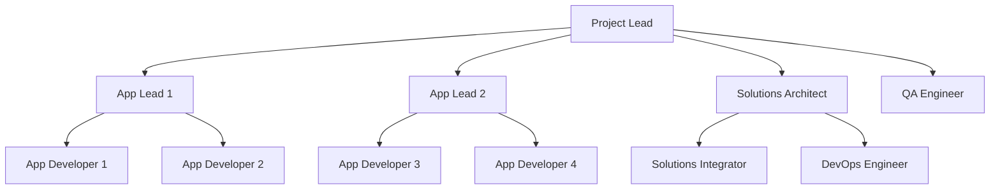

# Team Workflows Guide

Complete guide for team collaboration, Git workflows, and coordination strategies when working with the client project template.

## 🎯 Overview

This template is designed for **conflict-free multi-developer collaboration** through isolated project management and clear coordination patterns. Teams can work simultaneously on different applications without stepping on each other.

## 👥 Team Structure & Roles

### Recommended Team Organization



### Role Responsibilities

| Role | Primary Focus | Work Areas |
|------|---------------|------------|
| **Project Lead** | Overall coordination, client communication | `guides/developer/`, project-level ADRs |
| **App Lead** | Individual app architecture and quality | `apps/app_name/`, app-specific coordination |
| **App Developer** | Feature development within assigned app | `apps/app_name/workflows/`, `apps/app_name/tests/` |
| **Solutions Architect** | Cross-app coordination, shared services | `solutions/`, cross-app integration patterns |
| **Solutions Integrator** | Implementation of cross-app workflows | `solutions/tenant_orchestration/`, `solutions/data_integration/` |
| **DevOps Engineer** | Infrastructure, deployment, monitoring | `deployment/`, CI/CD pipelines |
| **QA Engineer** | Testing strategy, quality assurance | All `tests/` directories, test automation |

## 🏗️ Isolation Strategy

### App-Level Isolation

Each application has **completely isolated project management**:

```
apps/user_management/          apps/analytics/
├── adr/                       ├── adr/
│   ├── 001-auth-strategy.md   │   ├── 001-data-pipeline.md
│   └── 002-database-choice.md │   └── 002-visualization.md
├── todos/                     ├── todos/
│   ├── 000-master.md          │   ├── 000-master.md
│   └── 001-sprint-planning.md │   └── 001-performance.md
├── mistakes/                  ├── mistakes/
│   ├── 000-master.md          │   ├── 000-master.md
│   └── auth-pitfalls.md       │   └── data-quality.md
└── tests/                     └── tests/
    ├── unit/                      ├── unit/
    ├── integration/               ├── integration/
    └── functional/                └── functional/
```

### Benefits of Isolation

1. **No Merge Conflicts**: Teams never edit the same files
2. **Independent Planning**: Each app has its own roadmap and priorities
3. **Focused Documentation**: App-specific decisions stay with the app
4. **Clear Ownership**: Obvious responsibility boundaries
5. **Parallel Development**: Teams work simultaneously without coordination overhead

## 🔄 Git Workflow Strategy

### Branch Strategy

**Main Branches:**
```
main                    # Production-ready code
├── develop            # Integration branch
├── feature/app-name/* # App-specific feature branches
├── solution/*         # Cross-app coordination features
└── hotfix/*          # Emergency fixes
```

**Branch Naming Convention:**
```bash
# App-specific features
feature/user-mgmt/password-reset
feature/analytics/real-time-dashboard
feature/documents/ai-processing

# Cross-app features  
solution/user-onboarding-flow
solution/compliance-audit-system

# Infrastructure changes
infra/kubernetes-deployment
infra/monitoring-setup

# Bug fixes
bugfix/user-mgmt/login-issue
hotfix/security-vulnerability
```

### Team-Specific Workflows

#### App Development Teams

**Daily Workflow:**
```bash
# 1. Start day - sync with develop
git checkout develop
git pull origin develop

# 2. Create feature branch for your app
git checkout -b feature/user-mgmt/new-auth-flow

# 3. Work in your app's directory
cd apps/user_management

# 4. Update your app's todos
echo "- [x] Implement OAuth2 flow" >> todos/000-master.md
echo "- [ ] Add integration tests" >> todos/000-master.md

# 5. Document decisions
echo "# OAuth2 Provider Selection" > adr/003-oauth2-provider.md

# 6. Develop and test
# (work happens in apps/user_management/)

# 7. Commit with clear scope
git add apps/user_management/
git commit -m "feat(user-mgmt): implement OAuth2 authentication flow

- Add OAuth2 client configuration
- Implement authorization code flow
- Add token validation middleware
- Update user model with OAuth fields"

# 8. Push and create PR
git push origin feature/user-mgmt/new-auth-flow
```

#### Solutions Architecture Team

**Cross-App Integration Workflow:**
```bash
# 1. Analyze cross-app requirements
cd solutions/
echo "- [ ] Design user onboarding workflow" >> todos/000-master.md

# 2. Document architecture decisions
echo "# Cross-App User Onboarding Strategy" > adr/001-user-onboarding.md

# 3. Create solution branch
git checkout -b solution/user-onboarding-workflow

# 4. Implement coordination logic
# (work in solutions/tenant_orchestration/)

# 5. Test integration points
# (test with all affected apps)

# 6. Document coordination patterns
echo "# User Onboarding Integration" > tenant_orchestration/README.md

# 7. Commit cross-app changes
git add solutions/
git commit -m "feat(solutions): implement cross-app user onboarding workflow

- Add CompleteUserOnboardingWorkflow in tenant_orchestration
- Integrate user_management, analytics, and document_processor apps
- Add shared authentication service
- Document cross-app coordination patterns"
```

### Pull Request Strategy

#### App-Specific PRs

**PR Template for App Changes:**
```markdown
## App: User Management

### Summary
Brief description of the changes made to the user management app.

### Changes Made
- [ ] Core business logic changes
- [ ] API endpoint modifications  
- [ ] Database schema updates
- [ ] Workflow implementations
- [ ] Test coverage updates

### App-Specific Impact
- **ADRs Updated**: List any architecture decisions documented
- **TODOs Completed**: Reference completed tasks
- **Tests Added**: Describe test coverage
- **Breaking Changes**: None / List any breaking changes

### Integration Points
- **Cross-App Dependencies**: None / List any dependencies on other apps
- **Solutions Layer Impact**: None / Describe any impact on cross-app coordination

### Testing
- [ ] Unit tests pass
- [ ] Integration tests pass
- [ ] App-specific functional tests pass
- [ ] Cross-app integration verified (if applicable)

### Documentation
- [ ] README updated
- [ ] ADRs documented
- [ ] TODOs updated
- [ ] Mistakes/learnings recorded
```

#### Cross-App Integration PRs

**PR Template for Solutions Changes:**
```markdown
## Solutions: Cross-App Integration

### Summary
Brief description of the cross-app coordination changes.

### Apps Affected
- [ ] User Management
- [ ] Analytics  
- [ ] Document Processor
- [ ] Other: ___________

### Integration Changes
- [ ] New cross-app workflows
- [ ] Shared services updates
- [ ] Data integration modifications
- [ ] Event-driven coordination

### Coordination Impact
- **Workflow Changes**: Describe new or modified cross-app workflows
- **Data Flow**: Explain any changes to data flow between apps
- **Dependencies**: List new dependencies between apps
- **Breaking Changes**: None / List any breaking changes

### Testing Strategy
- [ ] Individual app tests pass
- [ ] Cross-app integration tests pass
- [ ] End-to-end workflow tests pass
- [ ] Performance impact assessed

### Rollout Plan
- [ ] Can be deployed independently
- [ ] Requires coordinated deployment
- [ ] Backward compatibility maintained
- [ ] Rollback strategy defined
```

## 📋 Project Management Workflows

### Planning & Coordination

#### Weekly Team Coordination

**Monday: Cross-Team Planning**
```bash
# Project Lead facilitates
# 1. Review overall project status
cat guides/developer/project-status.md

# 2. Each app lead reports status
cd apps/user_management && cat todos/000-master.md
cd apps/analytics && cat todos/000-master.md

# 3. Solutions architect reports integration status
cd solutions && cat todos/000-master.md

# 4. Identify cross-app dependencies
# 5. Plan week's coordination points
```

**Wednesday: Mid-Week Sync**
```bash
# Quick sync on blockers and dependencies
# Review any emerging cross-app requirements
# Adjust priorities if needed
```

**Friday: Week Wrap-Up**
```bash
# Review completed work
# Update project documentation
# Plan next week's priorities
# Document lessons learned
```

#### Sprint Planning Process

**Epic Creation (Project Level):**
```markdown
# Epic: Enhanced User Authentication

## Overview
Implement enterprise-grade authentication across all applications.

## Apps Involved
- User Management (primary)
- Analytics (integration)
- Document Processor (integration)

## Cross-App Coordination
- Single sign-on across applications
- Unified permission management
- Audit trail across all apps

## Success Criteria
- [ ] SSO works across all apps
- [ ] Permission model is consistent
- [ ] Audit logs capture all actions
- [ ] Performance meets requirements

## App-Specific Stories
### User Management App
- [ ] Implement OAuth2 provider
- [ ] Add multi-factor authentication
- [ ] Create admin user management

### Analytics App  
- [ ] Integrate with SSO
- [ ] Add user behavior tracking
- [ ] Implement permission-based data access

### Document Processor App
- [ ] SSO integration
- [ ] Document-level permissions
- [ ] User activity logging

### Solutions Layer
- [ ] Cross-app authentication service
- [ ] Unified audit workflow
- [ ] Permission synchronization
```

### Task Management

#### Individual Developer Workflow

**Daily Task Management:**
```bash
# Morning: Review your app's todos
cd apps/my_app
cat todos/000-master.md

# Update status of your tasks
sed -i 's/- \[ \] My task/- \[~\] My task/' todos/000-master.md  # In progress
sed -i 's/- \[~\] My task/- \[x\] My task/' todos/000-master.md  # Completed

# Add new tasks as they emerge
echo "- [ ] Fix validation bug in user form" >> todos/001-current-sprint.md

# Evening: Document what you learned
echo "## Validation Library Gotcha" >> mistakes/validation-issues.md
echo "The validation library requires..." >> mistakes/validation-issues.md
```

#### Architecture Decision Workflow

**Making Architecture Decisions:**
```bash
# 1. Identify decision needed
cd apps/my_app  # or solutions/ for cross-app decisions

# 2. Research options
# 3. Document decision
cp adr/001-template.md adr/003-database-choice.md

# 4. Fill in decision template:
# - Context: What's the situation?
# - Options: What are the alternatives?
# - Decision: What did we choose?
# - Consequences: What are the impacts?

# 5. Review with team
# 6. Implement decision
# 7. Update todos with implementation tasks
```

## 🔄 Code Review Process

### Review Assignments

**App-Specific Reviews:**
- **Primary Reviewer**: App lead or senior app developer
- **Secondary Reviewer**: Solutions architect (for integration impact)
- **Domain Expert**: Relevant specialist (security, performance, etc.)

**Cross-App Reviews:**
- **Primary Reviewer**: Solutions architect
- **App Reviewers**: Lead from each affected app
- **Project Reviewer**: Project lead for major changes

### Review Checklist

#### For App Changes
```markdown
- [ ] **Code Quality**
  - [ ] Follows app coding standards
  - [ ] Proper error handling
  - [ ] Performance considerations addressed
  
- [ ] **SDK Integration**
  - [ ] Uses Kailash SDK patterns correctly
  - [ ] Follows established workflow patterns
  - [ ] No custom reimplementation of SDK features

- [ ] **Testing**
  - [ ] Unit tests added/updated
  - [ ] Integration tests pass
  - [ ] Test coverage is adequate
  
- [ ] **Documentation**
  - [ ] ADRs updated if needed
  - [ ] TODOs reflect current state
  - [ ] README updated if needed
  
- [ ] **Integration Impact**
  - [ ] No breaking changes to other apps
  - [ ] API contracts maintained
  - [ ] Cross-app implications considered
```

#### For Solutions Changes
```markdown
- [ ] **Cross-App Coordination**
  - [ ] All affected apps considered
  - [ ] Integration patterns are clear
  - [ ] Data flow is well-defined
  
- [ ] **Workflow Design**
  - [ ] Uses proper SDK coordination patterns
  - [ ] Error handling across app boundaries
  - [ ] Performance impact assessed
  
- [ ] **Testing Strategy**
  - [ ] Integration tests cover all affected apps
  - [ ] End-to-end scenarios tested
  - [ ] Rollback procedures verified
  
- [ ] **Deployment Coordination**
  - [ ] Deployment dependencies identified
  - [ ] Backward compatibility maintained
  - [ ] Migration strategy documented
```

## 🚀 Release Management

### Release Types

#### App-Specific Releases
```bash
# Individual app can be released independently
cd apps/user_management

# Tag app-specific release
git tag -a user-mgmt-v1.2.0 -m "User Management v1.2.0: OAuth2 implementation"

# Deploy just this app
./deployment/scripts/deploy-app.sh user_management v1.2.0
```

#### Coordinated Releases
```bash
# When cross-app changes require coordination
git tag -a platform-v2.0.0 -m "Platform v2.0.0: Cross-app authentication"

# Deploy all affected apps in order
./deployment/scripts/deploy-coordinated.sh v2.0.0
```

### Release Planning

**Release Readiness Checklist:**
```markdown
## App Release: User Management v1.2.0

### Development Complete
- [ ] All planned features implemented
- [ ] Code review completed
- [ ] Documentation updated

### Testing Passed  
- [ ] Unit tests: 100% pass
- [ ] Integration tests: 100% pass
- [ ] Performance tests: Within limits
- [ ] Security scan: No critical issues

### Cross-App Verification
- [ ] No breaking changes to other apps
- [ ] Integration points tested
- [ ] Solutions layer compatibility verified

### Deployment Ready
- [ ] Database migrations prepared
- [ ] Configuration updates documented
- [ ] Rollback plan documented
- [ ] Monitoring alerts configured

### Communication
- [ ] Team notified of release plan
- [ ] Client stakeholders informed
- [ ] Support team briefed
```

## 🛟 Conflict Resolution

### Preventing Conflicts

**Structural Prevention:**
- **Isolated Workspaces**: Each app has separate directories
- **Clear Ownership**: Defined responsibility boundaries
- **Communication Channels**: Regular sync meetings
- **Documentation Standards**: Consistent ADR and TODO processes

**Process Prevention:**
```bash
# Before starting work, check for conflicts
git pull origin develop

# Check if other teams are working on related features
grep -r "my_feature" apps/*/todos/
grep -r "my_feature" solutions/todos/

# Communicate with affected teams
# Update project coordination channel
```

### Resolving Technical Conflicts

**When Apps Need the Same Shared Functionality:**
1. **Identify the Conflict**: Multiple apps implementing similar features
2. **Evaluate Options**: 
   - Move to shared services in solutions layer
   - Create SDK node for reusability
   - Keep separate if truly app-specific
3. **Design Shared Solution**: If needed, create in `solutions/shared_services/`
4. **Refactor Apps**: Update apps to use shared solution
5. **Document Decision**: Record in relevant ADRs

**Example Resolution:**
```bash
# Problem: Both user_management and analytics need email sending
# Solution: Create shared email service

# 1. Create shared service
mkdir -p solutions/shared_services/email_service

# 2. Implement shared email workflow
# solutions/shared_services/email_service/email_workflow.py

# 3. Update apps to use shared service
# apps/user_management/workflows/notification_workflow.py
# apps/analytics/workflows/report_workflow.py

# 4. Document decision
echo "# Shared Email Service Decision" > solutions/adr/002-shared-email.md
```

## 📊 Metrics and KPIs

### Team Productivity Metrics

**Development Velocity:**
- Stories completed per sprint per app
- Cross-app integration features delivered
- Code review turnaround time
- Deployment frequency

**Quality Metrics:**
- Test coverage per app
- Bug rate per app
- Cross-app integration issues
- Documentation completeness

**Collaboration Metrics:**
- Merge conflict frequency (should be near zero)
- Cross-team communication effectiveness
- Knowledge sharing activities
- Architecture decision documentation rate

### Monitoring Team Health

**Weekly Health Check:**
```bash
# Check app team isolation effectiveness
find apps/ -name "*.md" -exec grep -l "conflict" {} \;  # Should be empty

# Review cross-app coordination effectiveness  
grep -r "blocked" solutions/todos/  # Check for coordination blockers

# Assess documentation quality
find . -name "adr" -type d -exec ls -la {} \;  # Ensure ADRs are being created

# Check test coverage trends
find . -name "test_*.py" | wc -l  # Monitor test growth
```

## 🎯 Best Practices Summary

### For App Development Teams

1. **Stay in Your Lane**: Work primarily within your app's directory
2. **Document Decisions**: Use ADRs for all significant choices
3. **Track Progress**: Keep TODOs current and accurate
4. **Learn from Mistakes**: Document issues in mistakes/ for team learning
5. **Communicate Early**: Flag cross-app dependencies immediately

### For Solutions Architecture Team

1. **Think Integration**: Consider all apps in solution design
2. **Design for Change**: Build flexible coordination patterns
3. **Document Patterns**: Create reusable integration templates
4. **Test Thoroughly**: Validate all cross-app scenarios
5. **Plan Deployment**: Consider coordination requirements

### For Project Leadership

1. **Facilitate Communication**: Regular cross-team sync meetings
2. **Monitor Integration**: Watch for emerging cross-app needs
3. **Protect Isolation**: Prevent unnecessary coupling between apps
4. **Quality Gates**: Ensure proper testing and documentation
5. **Client Focus**: Align technical decisions with client value

---

**This team workflow strategy enables large teams to work efficiently on complex enterprise projects while maintaining code quality and avoiding the typical coordination overhead of multi-application development.**