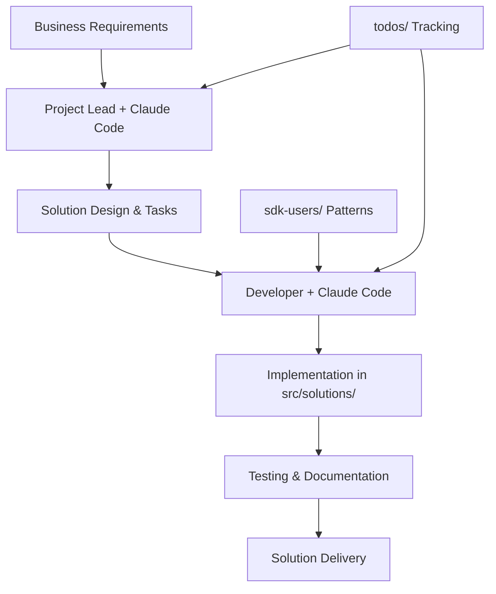

# Claude Code Workflow for Solution Development

## 🎯 Overview

This workflow system enables SDK User Teams to build enterprise solutions efficiently using Claude Code as the intelligent development assistant. All project management, task tracking, and development guidance flows through conversational AI.

## 🚀 Quick Start

### For Solution Developers
1. Start work session: Use `solution-developer-guide.md`
2. Get requirements and implementation guidance
3. Build solutions in `src/solutions/`
4. Update progress conversationally
5. Document patterns and learnings

### For Project Leads
1. Plan solutions: Use `project-lead-guide.md`
2. Break down business requirements
3. Assign work through Claude Code
4. Monitor progress and quality
5. Guide architecture decisions

## 📂 System Components

### Core Guides
- **`START_HERE.md`** - Introduction to the workflow system
- **`ONBOARDING_CHECKLIST.md`** - Step-by-step setup for new developers
- **`COMMON_MISTAKES.md`** - Avoid common pitfalls

### Role-Specific Guides
- **`guides/solution-developer-guide.md`** - Daily workflow for developers
- **`guides/project-lead-guide.md`** - Planning and management workflow

### Supporting Files
- **`team-profiles.md`** - Team member skills and availability
- **`templates/`** - Copy-paste ready conversation templates
- **`validation/`** - Environment setup and verification scripts

## 🔄 How It Works

## 💡 Key Principles

1. **Conversational Everything**: All interactions use natural language with Claude Code
2. **SDK Patterns**: Reference (never edit!) patterns from `sdk-users/`
3. **Solution Focus**: All custom code in `src/solutions/`
4. **Automated Tracking**: Claude Code maintains todos and progress
5. **Learning Culture**: Document mistakes and patterns for future use

## ⚠️ Critical Rules

### Never Edit sdk-users/
The `sdk-users/` directory is **READ-ONLY** and synced from the template:
- ❌ Don't modify any files
- ❌ Don't add custom code
- ❌ Don't fix bugs locally
- ✅ Report issues upstream
- ✅ Use for reference only

### Always Use Claude Code
All project management happens through conversation:
- ❌ No manual TODO editing
- ❌ No direct file updates for tracking
- ✅ Natural language updates
- ✅ AI-assisted planning

## 🎯 Workflow Benefits

- **Intelligent Guidance**: Claude Code knows SDK patterns and best practices
- **Consistent Process**: Everyone follows the same workflow
- **Automatic Documentation**: Progress and decisions are tracked
- **Reduced Errors**: AI catches common mistakes early
- **Faster Development**: Get implementation help instantly

## 📚 Getting Started

### New Team Member?
1. Start with [NEW_TEAM_MEMBER.md](../../NEW_TEAM_MEMBER.md) at project root
2. Follow the onboarding checklist
3. Set up your environment
4. Practice the workflow
5. Build your first solution

### Existing Team Member?
Jump to your role guide:
- [Solution Developer Guide](guides/solution-developer-guide.md)
- [Project Lead Guide](guides/project-lead-guide.md)

## 🔧 Troubleshooting

Common issues and solutions:
1. **Can't find patterns?** → Check `sdk-users/workflows/`
2. **Claude Code confused?** → Provide more context
3. **Environment issues?** → Run validation scripts
4. **Process questions?** → Review START_HERE.md

---

*This workflow is automatically synced from the template. Do not edit locally.*
