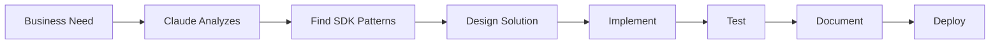

# 🚀 Solution Development with Claude Code - START HERE

## ⚠️ This Is How We Build Solutions

We use **Claude Code** for ALL solution development. This isn't just a tool - it's your AI pair programmer who knows the Kailash SDK inside and out.

## 🎯 What This Means For You

### Your New Development Reality
- **All planning** happens through Claude Code conversations
- **All guidance** comes from AI that knows SDK patterns
- **All tracking** flows automatically through conversation
- **Zero manual** project management files

### What You'll Never Do
❌ **Edit TODO files** manually in `todos/`  
❌ **Modify SDK docs** in `sdk-users/` (it's read-only!)  
❌ **Create tracking** spreadsheets or documents  
❌ **Debug alone** without Claude Code assistance  
❌ **Skip progress** updates in conversation  

## 📋 Your Daily Workflow

### 1️⃣ Morning: Start Your Session
```
You: "I'm starting my work session. I'm working on [solution/feature]"

Claude Code: [Shows your current tasks, priorities, and where to focus]
```

### 2️⃣ During Development: Get Help
```
You: "I need to implement [business requirement]. Show me relevant SDK patterns."

Claude Code: [Provides patterns from sdk-users/, suggests approach, generates starter code]
```

### 3️⃣ Progress Updates: Stay on Track
```
You: "Update: Completed data ingestion pipeline, working on transformation logic now"

Claude Code: [Updates tracking, suggests next steps, identifies potential issues]
```

### 4️⃣ End of Day: Wrap Up
```
You: "Wrapping up for today. Completed [X], tomorrow will focus on [Y]"

Claude Code: [Saves progress, updates todos, prepares tomorrow's plan]
```

## 🔑 Essential Commands

### Get Implementation Help
```
"Show me how to [specific task] using Kailash SDK"
"What's the best pattern for [business requirement]?"
"Help me debug this error: [error message]"
```

### Find Patterns
```
"Show examples of [pattern type] from sdk-users/"
"What nodes should I use for [process]?"
"Find similar workflows in the SDK examples"
```

### Update Progress
```
"Update: [what you did], [current status], [next steps]"
"I'm blocked on [issue] because [reason]"
"Completed [task], ready for next assignment"
```

### Architecture Decisions
```
"Should I use [approach A] or [approach B] for [requirement]?"
"Document decision: Using [pattern] because [reasoning]"
"What are the trade-offs of [design choice]?"
```

## 📚 How to Build Solutions

### Step 1: Understand Requirements
```
"Help me break down this requirement: [business need]"
"What Kailash patterns match this use case?"
"Show me similar implementations in sdk-users/"
```

### Step 2: Design Solution
```
"Design a workflow for [process description]"
"What nodes do I need for this pipeline?"
"How should I structure this in src/solutions/?"
```

### Step 3: Implement with Guidance
```
"Generate starter code for [component]"
"Help me implement [specific functionality]"
"Review this code for SDK best practices"
```

### Step 4: Test and Validate
```
"What test cases should I write?"
"Help me debug this issue: [problem]"
"Validate this matches the requirements"
```

## 🚨 Critical Success Factors

### 1. **Context is Everything**
❌ Bad: "Help me code"  
✅ Good: "Help me implement customer data validation for the onboarding workflow using DataTransformer"

### 2. **Reference, Don't Edit**
❌ Bad: "I'll fix this bug in sdk-users/nodes/"  
✅ Good: "I found a pattern in sdk-users/, how do I adapt it for my solution?"

### 3. **Build in the Right Place**
❌ Bad: Adding code to `sdk-users/` directory  
✅ Good: All custom code in `src/solutions/[your-module]/`

### 4. **Document Decisions**
❌ Bad: "I'll remember why I did this"  
✅ Good: "Document: Chose APIClient over RESTClient because of retry requirements"

## 🔄 The Solution Development Cycle



## 📊 What Claude Code Does For You

When you work conversationally, Claude Code:
- ✅ Finds relevant SDK patterns and examples
- ✅ Generates implementation code following best practices
- ✅ Updates project tracking automatically
- ✅ Documents architecture decisions
- ✅ Helps debug issues with SDK knowledge
- ✅ Suggests optimizations and improvements

## 🆘 When You Need Help

### If You're Stuck
```
"I'm stuck on [problem]. I've tried [attempts]. The error is [message]"
```

### If You're Unsure
```
"Is this the right approach for [requirement]? Here's what I'm thinking: [approach]"
```

### If Something's Wrong
```
"This doesn't seem right: [issue]. Should it work like [expected behavior]?"
```

## 🎓 SDK Resources (Read-Only!)

### Pattern Libraries
- **Workflows**: `sdk-users/workflows/` - Complete examples by pattern
- **Essentials**: `sdk-users/essentials/` - Quick reference guides
- **Templates**: `sdk-users/templates/` - Starter code
- **Nodes**: `sdk-users/nodes/` - Component documentation

### Never Edit These!
Remember: The entire `sdk-users/` directory is synced from the template. Any changes will be lost!

## ✅ Your Next Steps

1. **Set Up Environment**: Run validation scripts
2. **Review Requirements**: Understand what you're building
3. **Start Conversation**: Begin with Claude Code
4. **Build Solution**: Implement in `src/solutions/`
5. **Track Progress**: Update through conversation

## 💡 Pro Tips

### From Experienced Developers
- "Always provide business context, not just technical details"
- "Let Claude Code find patterns - don't search manually"
- "Update progress at natural breakpoints"
- "Ask for code review on complex implementations"
- "Document 'why' not just 'what' in decisions"

### Common Patterns
- **Monday**: Review requirements, plan approach
- **Daily**: Morning setup, implementation, evening update
- **Testing**: Ask for test scenarios and edge cases
- **Debugging**: Provide full error context
- **Friday**: Document learnings, plan next week

---

## Ready to Build?

### First-Time Setup
→ Complete **[ONBOARDING_CHECKLIST.md](ONBOARDING_CHECKLIST.md)**

### Starting a Solution
→ Follow **[Solution Developer Guide](guides/solution-developer-guide.md)**

### Planning Work
→ Use **[Project Lead Guide](guides/project-lead-guide.md)**

### Need Examples?
→ Check **[Common Mistakes](COMMON_MISTAKES.md)** first

---

*Remember: Claude Code knows the SDK better than any documentation. Use it!*