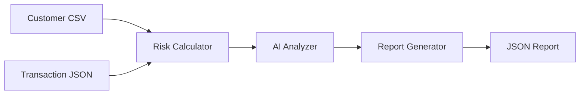

# Workflow Design Patterns

Strategic patterns for building robust, maintainable workflows based on real-world implementations.

## 🎯 Design Process

### 1. **Start with Data Flow**
Always begin by mapping your data sources, transformations, and outputs.



### 2. **Identify Data Sources Early**
Map all inputs before writing any code:

```python
# ✅ PLAN FIRST - Document all data sources
"""
Data Sources:
- customers.csv (customer profiles, tiers)
- transactions.csv (payment history)
- market_data.csv (external reference data)

Outputs:
- risk_report.json (analysis results)
- alerts.json (high-risk customers)
"""
```

### 3. **Use Existing Nodes Before Custom Code**
Check the node catalog before writing PythonCodeNode:

```python
# ❌ DON'T write custom code for standard operations
processor = PythonCodeNode(
    name="csv_reader",
    code="import pandas as pd; result = pd.read_csv(file_path).to_dict('records')"
)

# ✅ USE existing nodes for standard operations
reader = CSVReaderNode(name="csv_reader", file_path=data_path)
```

## 🏗️ Common Design Patterns

### Pattern 1: ETL with Validation
Extract → Transform → Load with validation at each step

```python
def create_etl_workflow():
    workflow = Workflow("etl-pattern", "ETL with Validation")
    
    # Extract
    source_reader = CSVReaderNode(name="source", file_path=input_path)
    workflow.add_node("source", source_reader)
    
    # Validate input
    validator = PythonCodeNode.from_function(name="validator", func=validate_input)
    workflow.add_node("validator", validator)
    
    # Transform
    transformer = PythonCodeNode.from_function(name="transformer", func=transform_data)
    workflow.add_node("transformer", transformer)
    
    # Load
    writer = JSONWriterNode(name="writer", file_path=output_path)
    workflow.add_node("writer", writer)
    
    # Connect with error handling
    workflow.connect("source", "validator", mapping={"data": "raw_data"})
    workflow.connect("validator", "transformer", mapping={"result": "validated_data"})
    workflow.connect("transformer", "writer", mapping={"result": "data"})
    
    return workflow
```

### Pattern 2: Multi-Source Data Integration
Combine multiple data sources with proper ID normalization

```python
def normalize_customer_ids(customers: list, transactions: list) -> dict:
    """Handle ID format mismatches between data sources."""
    # Convert customer IDs from 'cust1' to 'C001' format
    customer_df = pd.DataFrame(customers)
    if 'customer_id' in customer_df.columns:
        customer_df['customer_id_norm'] = (
            customer_df['customer_id']
            .str.extract(r'(\d+)')[0]
            .str.zfill(3)
            .apply(lambda x: f'C{x}')
        )
    
    # Ensure transaction IDs match format
    transaction_df = pd.DataFrame(transactions)
    if 'customer_id' in transaction_df.columns:
        transaction_df['customer_id_norm'] = transaction_df['customer_id']
    
    return {
        'result': {
            'customers': customer_df.to_dict('records'),
            'transactions': transaction_df.to_dict('records')
        }
    }

# Usage in workflow
id_normalizer = PythonCodeNode.from_function(
    name="id_normalizer",
    func=normalize_customer_ids
)
```

### Pattern 3: AI-Enhanced Processing
Combine rule-based logic with AI insights

```python
def create_ai_enhanced_workflow():
    workflow = Workflow("ai-enhanced", "AI-Enhanced Analysis")
    
    # 1. Rule-based analysis
    rule_processor = PythonCodeNode.from_function(
        name="rule_processor", 
        func=calculate_rule_based_score
    )
    
    # 2. AI analysis
    ai_analyzer = LLMAgentNode(
        name="ai_analyzer",
        model="gpt-4",
        system_prompt="You are a domain expert. Analyze the data and provide insights.",
        prompt="Analyze this data: {{rule_results}}"
    )
    
    # 3. Combine results
    result_combiner = PythonCodeNode.from_function(
        name="combiner",
        func=combine_rule_and_ai_results
    )
    
    # Connect AI feedback loop
    workflow.connect("rule_processor", "ai_analyzer", mapping={"result": "rule_results"})
    workflow.connect("rule_processor", "combiner", mapping={"result": "rule_analysis"})
    workflow.connect("ai_analyzer", "combiner", mapping={"response": "ai_analysis"})
    
    return workflow
```

### Pattern 4: Error-Resilient Pipeline
Handle failures gracefully with fallback strategies

```python
def safe_processing_function(input_data: dict) -> dict:
    """Process data with comprehensive error handling."""
    try:
        # Main processing logic
        processed = complex_processing(input_data)
        return {'result': processed, 'status': 'success'}
    
    except ValidationError as e:
        # Data validation failed - return partial results
        return {
            'result': input_data,
            'status': 'validation_failed',
            'error': str(e),
            'fallback_applied': True
        }
    
    except ProcessingError as e:
        # Processing failed - use fallback method
        fallback_result = simple_fallback_processing(input_data)
        return {
            'result': fallback_result,
            'status': 'fallback_success',
            'error': str(e),
            'fallback_applied': True
        }
    
    except Exception as e:
        # Unknown error - return error state
        return {
            'result': {},
            'status': 'error',
            'error': str(e),
            'fallback_applied': False
        }
```

## 📊 Advanced Patterns

### Pattern 5: Workflow Composition
Build complex workflows from reusable components

```python
class WorkflowComponents:
    @staticmethod
    def create_data_ingestion_stage(name_prefix: str, file_path: str):
        """Reusable data ingestion component."""
        reader = CSVReaderNode(name=f"{name_prefix}_reader", file_path=file_path)
        validator = PythonCodeNode.from_function(
            name=f"{name_prefix}_validator",
            func=validate_data_quality
        )
        return reader, validator
    
    @staticmethod
    def create_ai_analysis_stage(name_prefix: str, domain_prompt: str):
        """Reusable AI analysis component."""
        analyzer = LLMAgentNode(
            name=f"{name_prefix}_analyzer",
            model="gpt-4",
            system_prompt=domain_prompt,
            prompt="Analyze: {{data}}"
        )
        return analyzer

# Compose workflows from components
def create_composed_workflow():
    workflow = Workflow("composed", "Composed Workflow")
    
    # Add standard components
    customer_reader, customer_validator = WorkflowComponents.create_data_ingestion_stage(
        "customer", get_input_data_path("customers.csv")
    )
    
    risk_analyzer = WorkflowComponents.create_ai_analysis_stage(
        "risk", "You are a risk assessment expert..."
    )
    
    # Connect components
    workflow.add_node("customer_reader", customer_reader)
    workflow.add_node("customer_validator", customer_validator)
    workflow.add_node("risk_analyzer", risk_analyzer)
    
    return workflow
```

### Pattern 6: Performance-Optimized Processing
Handle large datasets efficiently

```python
def batch_process_large_dataset(input_data: list, batch_size: int = 1000) -> dict:
    """Process large datasets in batches."""
    results = []
    total_records = len(input_data)
    
    for i in range(0, total_records, batch_size):
        batch = input_data[i:i + batch_size]
        
        # Process batch
        batch_result = process_batch(batch)
        results.extend(batch_result)
        
        # Progress tracking
        progress = min((i + batch_size) / total_records * 100, 100)
        print(f"Processed {progress:.1f}% ({i + len(batch)}/{total_records})")
    
    return {
        'result': results,
        'total_processed': len(results),
        'batch_size': batch_size
    }

# Use in workflow for large datasets
large_processor = PythonCodeNode.from_function(
    name="large_processor",
    func=batch_process_large_dataset
)
```

## 🎯 Design Principles

### 1. **Single Responsibility**
Each node should have one clear purpose:

```python
# ❌ BAD - One node doing too much
def process_everything(data):
    # Reads CSV, validates, transforms, analyzes, and writes output
    # Too many responsibilities!
    pass

# ✅ GOOD - Each node has one responsibility
reader = CSVReaderNode(name="reader")           # Read data
validator = PythonCodeNode.from_function(name="validator", func=validate)  # Validate
transformer = PythonCodeNode.from_function(name="transformer", func=transform)  # Transform
writer = JSONWriterNode(name="writer")          # Write results
```

### 2. **Explicit Data Flow**
Make data transformations obvious in connections:

```python
# ✅ CLEAR data flow with descriptive mapping names
workflow.connect("customer_reader", "risk_calculator", 
                mapping={"data": "customer_profiles"})
workflow.connect("transaction_reader", "risk_calculator",
                mapping={"data": "transaction_history"})
workflow.connect("risk_calculator", "ai_analyzer",
                mapping={"result": "calculated_metrics"})
```

### 3. **Fail-Fast Validation**
Validate inputs early in the pipeline:

```python
def validate_workflow_inputs(customers: list, transactions: list) -> dict:
    """Validate all inputs before processing begins."""
    errors = []
    
    # Check required fields
    if not customers:
        errors.append("Customer data is empty")
    
    if not transactions:
        errors.append("Transaction data is empty")
    
    # Validate data quality
    customer_df = pd.DataFrame(customers)
    required_customer_fields = ['customer_id', 'tier']
    missing_fields = [f for f in required_customer_fields if f not in customer_df.columns]
    
    if missing_fields:
        errors.append(f"Missing customer fields: {missing_fields}")
    
    if errors:
        return {'result': None, 'errors': errors, 'valid': False}
    
    return {'result': {'customers': customers, 'transactions': transactions}, 'valid': True}
```

## 🚀 Quick Start Checklist

When designing a new workflow:

1. **📋 Plan**: Document data sources, transformations, outputs
2. **🔍 Research**: Check existing nodes before writing custom code  
3. **⚡ Start Simple**: Build basic flow first, add complexity later
4. **🧪 Test Early**: Test each function independently before creating nodes
5. **🔗 Connect**: Use descriptive mapping names for clarity
6. **✅ Validate**: Add input validation and error handling
7. **📊 Monitor**: Include progress tracking for long-running workflows
8. **📝 Document**: Add clear descriptions for each node and connection

Remember: **Good workflow design is like good architecture - it should be obvious how it works!**